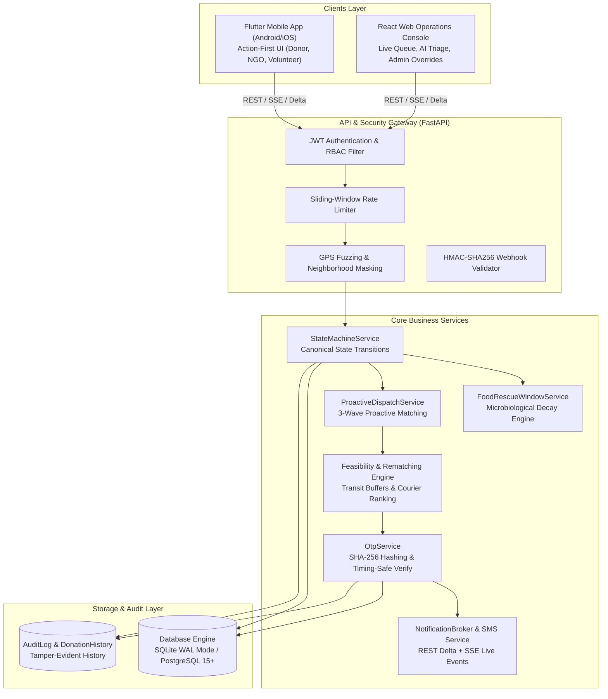
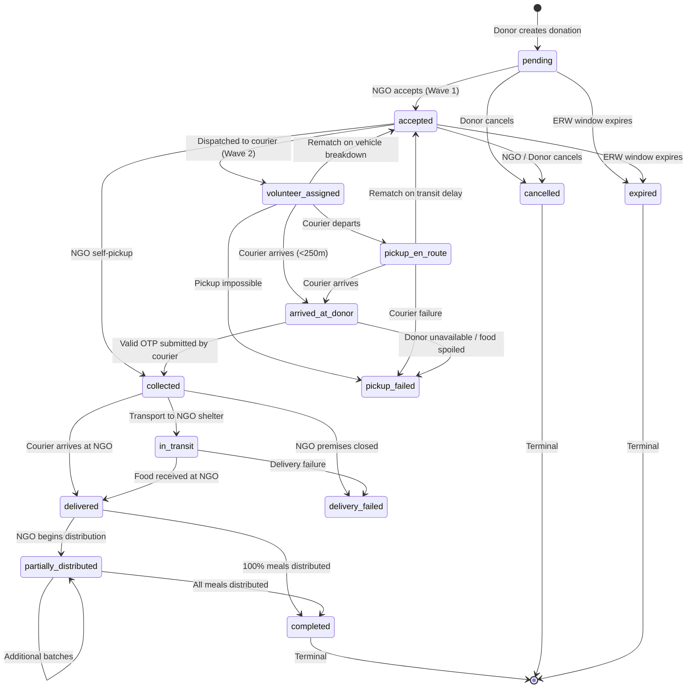
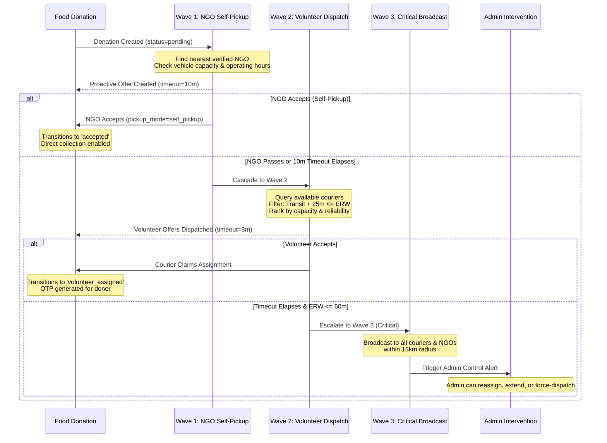

# Smart Food Rescue Platform — System Architecture & Technical Specifications

**Architecture Specification:** `v2.5`  
**Evaluation Date:** September 25, 2026  
**Document Identifier:** `ARCHITECTURE.md`  
**System Classification:** Zero-Cash, Hyper-Local Food Rescue Coordination Engine  

---

## 1. High-Level System Architecture

The **Smart Food Rescue Platform** connects four primary actor roles:
1. **Donors (Commercial/Catering):** Post surplus food with AI safety affirmations.
2. **Receiving NGOs / Shelters:** Review rescue opportunities and accept for self-pickup or courier delivery.
3. **Volunteer Couriers:** Claim feasible pickup missions and transport food to destination NGOs.
4. **Platform Administrators:** Monitor city-wide operations and intervene in disputes or critical rescues.



---

## 2. Backend Source of Truth & Layered Architecture

The platform strictly enforces the **Backend Source of Truth** principle:
- **Donation State:** Controlled entirely by the backend state machine. Frontends cannot force state transitions.
- **Estimated Rescue Window (ERW):** Calculated server-side using microbiological decay factors and ambient temperature multipliers.
- **Feasibility:** Couriers cannot claim assignments unless $T_{\text{transit}} + 25\text{m buffer} \le \text{ERW}$.
- **Security Decisions:** Role authorization, ownership validation, OTP verification, and rate limiting run exclusively on the server.

### 2.1 Technology Stack
- **Framework:** FastAPI 0.115+ (Python 3.13)
- **ORM & Data Layer:** SQLAlchemy 2.0 with Pydantic v2 schemas
- **Database Engine:** SQLite 3 with Write-Ahead Logging (WAL) and 30-second busy timeout (Local/Staging) / PostgreSQL 15+ with connection pooling (`pool_size=10, max_overflow=20`) (Production)
- **Live Event Transport:** In-memory asynchronous pub/sub broker (`NotificationBroker`) delivering Server-Sent Events (SSE) and REST delta polling (`/api/notifications/feed`)

---

## 3. Finite State Machine (FSM) Specification

The system manages three interrelated finite state machines with atomic row locks:

### 3.1 Donation Lifecycle FSM (`FoodDonation.status`)



### 3.2 State Transition Matrix & Role Gates

| Current State | Target State | Authorized Roles | Preconditions / Rules |
|---|---|---|---|
| `pending` | `accepted` | `ngo`, `admin` | Verified NGO; locks `MatchOffer` |
| `pending` | `cancelled` | `donor`, `admin` | Donor can cancel before acceptance |
| `pending` | `expired` | System Watchdog | $\text{Remaining Minutes} \le 0$ |
| `accepted` | `collected` | `ngo`, `admin` | Only valid when `pickup_mode="self_pickup"` |
| `accepted` | `volunteer_assigned`| `volunteer`, `admin` | Courier satisfies feasibility equation |
| `volunteer_assigned`| `pickup_en_route` | `volunteer`, `admin` | Courier starts transit |
| `volunteer_assigned`| `arrived_at_donor` | `volunteer`, `admin` | Courier GPS within 250m geofence |
| `volunteer_assigned`| `accepted` | `volunteer`, `admin` | Dynamic rematching triggered |
| `arrived_at_donor` | `collected` | `volunteer`, `admin`, `ngo` | Cryptographic OTP verified successfully |
| `collected` | `delivered` | `volunteer`, `admin` | Courier physically arrives at NGO shelter |
| `delivered` | `partially_distributed`| `ngo`, `admin` | NGO logs partial distribution intake |
| `delivered` | `completed` | `ngo`, `admin` | All meals distributed; impact computed |

---

## 4. Estimated Rescue Window (ERW) Decay Model

The backend evaluates food safety dynamically based on microbiological decay rules:

$$\text{ERW}_{\text{total}} = \text{BaseWindow}(\text{Category}) \times M_{\text{storage}} \times M_{\text{packaging}} - T_{\text{elapsed}}$$

$$\text{Remaining Minutes} = \max\left(0, \left\lfloor \frac{\text{Deadline} - \text{Now}}{60} \right\rfloor\right)$$

### 4.1 Decay Parameters by Food Category
- **Cooked Rice / Lentils / Gravy:** Base 4.0 hours, High risk, Conservative buffer: 30 minutes
- **Bakery & Bread:** Base 12.0 hours, Low risk, Conservative buffer: 60 minutes
- **Fresh Cut Fruits & Salads:** Base 3.0 hours, High risk, Conservative buffer: 20 minutes
- **Packaged Dry Goods:** Base 24.0 hours, Low risk, Conservative buffer: 120 minutes

### 4.2 Storage & Packaging Multipliers
- **Refrigerated (<4°C):** Multiplier $1.5\times$
- **Room Temperature (20°C–30°C):** Multiplier $1.0\times$
- **Warm / Insulated (>60°C):** Multiplier $1.2\times$
- **Sealed / Airtight Container:** Multiplier $1.1\times$
- **Open / Exposed:** Multiplier $0.7\times$

---

## 5. Three-Wave Proactive Dispatch Engine

Dispatch progresses automatically through 3 successive waves until claimed:



---

## 6. Security Perimeter & Privacy Architecture

The platform maintains 6 strict defensive layers:

1. **Authentication:** JWT tokens (15-minute access, 7-day refresh) signed with `JWT_SECRET`. Tokens re-verify user active state on every database query.
2. **RBAC & Ownership:** Role validation guards routes (`require_role(["donor", "volunteer", "ngo", "admin"])`). Donors can only inspect their own donations; couriers can only view their active assignment.
3. **One-Way OTP Hashing:** OTPs are stored exclusively as 64-character SHA-256 hex digests (`PickupOtpRecord.otp_hash`). Plaintext OTP is never stored in persistent storage. Comparisons execute in constant time via `secrets.compare_digest`.
4. **Replay & Concurrency Defense:** Single-use tokens flag `used_at = now` and `is_active = False`. Repeated submissions return `HTTP 409 Conflict`. Simultaneous requests are serialized using database row-level locking.
5. **GPS Privacy Fuzzing:** Unaccepted donations round latitude and longitude to 2 decimal places (~1.1km precision) and mask the street address with `"(Exact address revealed upon acceptance)"`. Full coordinates and address are only revealed to the assigned courier or NGO once accepted.
6. **HMAC Webhook Validation:** Inbound SMS delivery receipts on `/api/webhooks/sms-delivery` validate cryptographic `HMAC-SHA256` signatures (`X-Hub-Signature-256`, `X-SFR-Webhook-Signature`) using constant-time evaluation against `SMS_WEBHOOK_SECRET`.

---

## 7. Mobile & Web Client Architectures

### 7.1 Flutter Mobile Architecture (`mobile/`)
- **UI Pattern:** Material 3 Action-First design system. Focuses on field efficiency: large buttons, high contrast, minimal typing.
- **State Management:** Provider-based reactive architecture (`DonationProvider`, `AuthProvider`, `LanguageProvider`).
- **Urgency Visualization:** Curated 5-tier color system:
  - `FRESH`: Emerald Green
  - `APPROACHING`: Amber
  - `URGENT`: Orange
  - `CRITICAL`: Crimson Red
  - `ENDED`: Muted Slate Gray
- **Localization:** 100% key parity across English (`en`), Tamil (`ta`), and Hindi (`hi`).

### 7.2 React Web Operations Console (`web/`)
- **UI Pattern:** SPA dashboard engineered for live intervention and triage.
- **Key Modules:**
  - Active Food Receiving Feed with urgent countdown timers
  - AI Vision Condition Inspection Drawer
  - Force State Transition Modal with required audit remarks
  - Spatial Grid Clustering of city-wide rescue activity
- **Real-Time Integration:** REST delta polling with fallback to SSE stream. Zero third-party broker dependencies (no Redis/Kafka needed).

---

## 8. Data Storage Architecture

### 8.1 SQLite Write-Ahead Logging (WAL) Mode
In development, testing, and staging environments, the backend configures SQLite with:
```sql
PRAGMA journal_mode = WAL;
PRAGMA synchronous = NORMAL;
PRAGMA foreign_keys = ON;
PRAGMA busy_timeout = 30000;
```
This guarantees concurrent read-while-write transactions without database locked errors.

### 8.2 Production PostgreSQL Compatibility
The ORM and Alembic migrations are written for PostgreSQL 15+:
- Connection pool with pre-ping validation (`pool_size=10, max_overflow=20`)
- Standardized `TIMESTAMP WITH TIME ZONE` columns
- Explicit database indices on frequently queried fields (`ix_donations_status_created`, `ix_donations_donor_created`)
