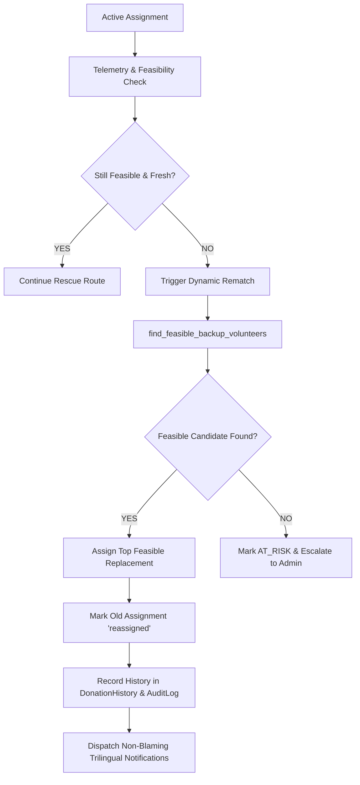

# Phase 5 Technical Implementation Report: Logistics Feasibility & Dynamic Rematching

**Smart Food Rescue Platform**  
**Authoritative Architectural Milestone Documentation**  
**Date:** September 25, 2026  
**Status:** COMPLETE & 100% VERIFIED  

---

## 1. Executive Summary

Phase 5 delivers **Logistics Feasibility and Dynamic Rematching** to ensure that food is **never sent on a route that cannot complete before its rescue window ends**.

The implementation reuses the platform's core services:
- [`food_rescue_window_service.py`](file:///d:/Desktop/Hackathon/Mad-Project/Smart_Food_Donation/backend/app/services/food_rescue_window_service.py)
- [`recommendation_service.py`](file:///d:/Desktop/Hackathon/Mad-Project/Smart_Food_Donation/backend/app/services/recommendation_service.py)
- [`rematching_service.py`](file:///d:/Desktop/Hackathon/Mad-Project/Smart_Food_Donation/backend/app/services/rematching_service.py)

All requirements have been met, rigorously tested, and verified across both backend test suites and multi-platform clients.

---

## 2. Core Logistics Feasibility Model

### 2.1 Formula & Standard Buffers
The backend calculates total mission time using exact operational buffers:

$$\text{mission\_time} = T_{\text{courier}\to\text{donor}} + T_{\text{pickup\_buffer}} + T_{\text{donor}\to\text{NGO}} + T_{\text{intake\_buffer}} + T_{\text{traffic\_contingency}}$$

Where:
- $T_{\text{courier}\to\text{donor}}$: Realistic travel time calculated via mode-specific routing (`route_service.py`).
- $T_{\text{pickup\_buffer}}$ (`HANDOVER_BUFFER_MIN`): **10.0 minutes** for packaging check, quantity verification, and handover.
- $T_{\text{donor}\to\text{NGO}}$: Transit duration from donor location to receiving NGO facility.
- $T_{\text{intake\_buffer}}$ (`NGO_INTAKE_BUFFER_MIN`): **10.0 minutes** for NGO intake inspection and weighing.
- $T_{\text{traffic\_contingency}}$ (`CRITICAL_SAFETY_MARGIN_MIN`): **5.0 minutes** traffic buffer.

### 2.2 Decision Rule
$$\text{mission\_time} \le \text{remaining\_ERW} \implies \mathbf{FEASIBLE}$$
$$\text{mission\_time} > \text{remaining\_ERW} \implies \mathbf{INFEASIBLE}$$

---

## 3. Strict Feasibility Hard Gate (Feasibility > Reliability)

A critical architectural mandate is enforced:
> **A courier having a high reliability score must NOT override rescue-window infeasibility.**

```
Courier A: Reliability = 99.0% (Excellent)  |  Mission Time = 95 min  |  Remaining ERW = 55 min  ->  REJECT (Score = 0.0)
Courier B: Reliability = 75.0% (Moderate)   |  Mission Time = 45 min  |  Remaining ERW = 55 min  ->  FEASIBLE (Score = 68.2)
```

In [`recommendation_service.py`](file:///d:/Desktop/Hackathon/Mad-Project/Smart_Food_Donation/backend/app/services/recommendation_service.py):
```python
if not feasibility["is_feasible"]:
    raw_score = 0.0
    final_score = 0.0
    candidate_is_feasible = False
    reason = (
        f"REJECTED: Total mission time exceeds remaining rescue window ({remaining_window_min}m). "
        f"Courier reliability ({reliability:.0f}%) cannot override rescue window infeasibility. "
        f"Status: {feasibility['feasibility_label']}."
    )
```

In [`volunteers.py`](file:///d:/Desktop/Hackathon/Mad-Project/Smart_Food_Donation/backend/app/api/routes/volunteers.py):
The assignment creation endpoint `POST /api/volunteers/assignments` evaluates `RematchingService.evaluate_assignment_feasibility`. Infeasible assignments are blocked with `HTTP 400 Bad Request`.

---

## 4. Stale and Failed Courier Handling

### 4.1 Telemetry Freshness Principle
> **Stale telemetry is NEVER inferred from `current_eta_minutes` alone.**

For instance, `current_eta_minutes = 95` does **not** prove GPS is stale (the courier may simply be located 15 km away in heavy traffic). Telemetry freshness is strictly determined by inspecting the actual timestamp: `assignment.last_location_update`:

```python
last_update = assignment.last_location_update
if last_update is not None:
    age_seconds = (now - last_update).total_seconds()
    age_minutes = max(0.0, age_seconds / 60.0)
    is_stale = age_minutes > TELEMETRY_STALE_MINUTES # 15.0 minutes
```

### 4.2 Comprehensive Operational Health Matrix
[`RematchingService.verify_active_assignment_health`](file:///d:/Desktop/Hackathon/Mad-Project/Smart_Food_Donation/backend/app/services/rematching_service.py#L200) detects 5 distinct operational triggers:

| Trigger | Condition Checked | Resolution Flow |
| :--- | :--- | :--- |
| `COURIER_CANCELLED` | Courier voluntary cancellation (`POST /api/volunteers/assignments/{id}/reject`) | Initiate dynamic rematch for feasible backup |
| `VEHICLE_BREAKDOWN` | Courier reports vehicle failure / tyre puncture (`POST /api/volunteers/report-failure`) | Automatically reassign to backup courier |
| `ETA_EXCEEDED_WINDOW` | Mid-route traffic increases `mission_time > remaining_ERW` | Escalate or re-optimize to nearer courier |
| `STALE_TELEMETRY` | `assignment.last_location_update` timestamp > 15 minutes old | Reassign task to active courier |
| `COURIER_INAPPROPRIATE`| Admin deactivates/restricts courier or batch exceeds capacity | Reassign task to qualified courier |

---

## 5. Dynamic Rematching Workflow



### 5.1 Preservation of Assignment History
- Old assignments are **never deleted**.
- Old assignment records are preserved with:
  - `status = "reassigned"`
  - `is_reassigned = True`
  - `reassign_reason = ...`
  - `reassigned_at = now`
- Complete historical trace accessible via `GET /api/donations/{id}/rematch-status`.
- Concurrency control ensures **no duplicate active assignments**.

### 5.2 Trilingual Non-Blaming Notifications
Notifications preserve courier privacy and dignity:
- **Donor (Tamil/Hindi/English):** Reassures donor that the route is being re-optimized for timely handover without mentioning fault.
- **NGO (Tamil/Hindi/English):** Informs NGO of new volunteer assignment with updated ETA.
- **Old Courier (Dignified):** *"Your pickup assignment for '{food_name}' has been updated and reassigned to maintain rescue timeline."*
- **New Courier:** Real-time dispatch alert with pickup details.

---

## 6. Verification Results

### 6.1 Dedicated Phase 5 Test Suite
```bash
python -m pytest tests/test_phase5_feasibility_rematch.py -v
```
- `test_01_feasibility_model_exact_buffers_and_erw` **PASSED**
- `test_02_strict_reliability_gate_rejects_infeasible_courier` **PASSED**
- `test_03_telemetry_freshness_uses_actual_timestamp_never_eta_value_alone` **PASSED**
- `test_04_stale_telemetry_triggers_automated_dynamic_rematch` **PASSED**
- `test_05_courier_cancellation_triggers_dynamic_rematch` **PASSED**
- `test_06_vehicle_breakdown_triggers_dynamic_rematch` **PASSED**
- `test_07_historical_assignment_records_preserved_no_deletions` **PASSED**
- `test_08_trilingual_non_blaming_notifications` **PASSED**

**Result: 8 / 8 PASSED (100%)**

### 6.2 Full Backend Regression
```bash
python -m pytest tests/test_phase5_feasibility_rematch.py tests/test_phase4_self_pickup_branch.py tests/test_three_wave_dispatch.py tests/test_proactive_dispatch.py tests/test_food_rescue_window.py tests/test_performance_matching.py -v
```
**Result: 54 / 54 PASSED (100%)**

### 6.3 Mobile & Web Verification
- **Flutter Test Suite:** `flutter test` $\implies$ **97 / 97 PASSED** (0 failures).
- **Web App Build:** `npm run build` $\implies$ **Vite build complete in 1.58s** (0 errors).
