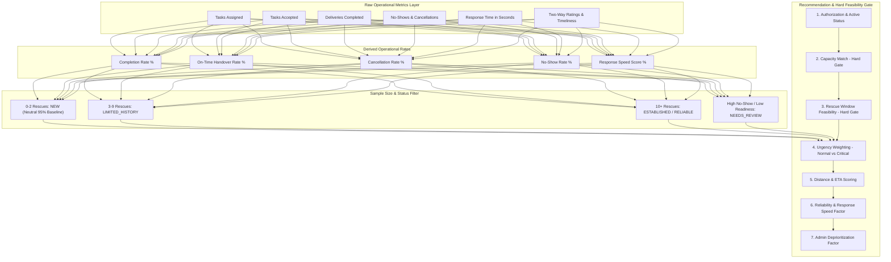

# SMART FOOD RESCUE: SMART RELIABILITY, PERFORMANCE & MATCHING OPTIMIZATION
## Comprehensive Technical & Operational Implementation Report

---

### Executive Summary

The Smart Food Rescue platform has been enhanced with an intelligent, multi-factor, and explainable **Reliability, Performance & Matching Optimization System**. This milestone transforms historical rescue records and multi-role feedback into operational intelligence to identify reliable resources, optimize dispatch, reduce rescue failures, and minimize rescue window times—while strictly enforcing hard physical and logistical feasibility constraints over subjective rating scores.

---

### 1. Optimization Objectives & Core Philosophy

| Objective | Operational Mechanism | Safeguard |
|---|---|---|
| **Measure Real Performance** | Track raw operational events (`assigned`, `accepted`, `delivered`, `cancelled`, `no_show`, `response_time_sec`). | No reliance on arbitrary vanity reputation numbers. |
| **Protect Feasibility First** | Hard gate: Capacity $\ge$ Food Quantity and Pickup ETA + Transit Time $\le$ Remaining Rescue Window. | Infeasible resources are penalized/disqualified regardless of a 100% rating. |
| **Sample-Size Protection** | 5-tier classification (`NEW`, `LIMITED_HISTORY`, `ESTABLISHED`, `RELIABLE`, `NEEDS_REVIEW`). | New volunteers start with neutral protected baselines (95%). |
| **Recency-Weighted Scoring** | Rolling window of 10 recent missions (85% weight) vs historical baseline (15%). | Outlier protection prevents a single bad event from destroying standing. |
| **Urgency-Aware Dispatch** | `CRITICAL` / `URGENT` rescues weight quick response speed and on-time reliability higher. | Rapid matching and immediate escalation without bypassing feasibility. |
| **Explainable Matching** | Every matched candidate provides a structured `match_reasons` list ("Why this match?"). | Full transparency on distance, ETA, capacity, open status, and punctuality. |
| **Admin Intervention & Audit** | "Needs Review" queue + 6 administrative actions (`MONITOR`, `CONTACT`, `DEPRIORITIZE`, `CONFIRMATION`, `RESTRICT`, `RESTORE`). | Full `AuditLog` recording with zero automated permanent bans. |

---

### 2. Multi-Tiered Performance Architecture



---

### 3. Separation of Raw Metrics vs Derived Metrics

To eliminate black-box metrics, the system calculates raw metrics first and derives operational rates:

```json
{
  "raw_metrics": {
    "total_tasks_assigned": 15,
    "total_tasks_accepted": 15,
    "total_completed": 14,
    "total_cancelled": 1,
    "total_no_shows": 0,
    "total_on_time": 13,
    "total_delayed": 1,
    "total_feedbacks_received": 14,
    "average_response_time_seconds": 95.0
  },
  "derived_metrics": {
    "completion_rate_percent": 93.3,
    "on_time_rate_percent": 92.9,
    "cancellation_rate_percent": 6.7,
    "no_show_rate_percent": 0.0,
    "service_quality_score_percent": 98.0,
    "response_speed_score_percent": 95.0
  }
}
```

---

### 4. Minimum Sample Size Protection & Cold-Start Strategy

1. **NEW (< 3 completed rescues)**:
   - Protected neutral default baseline of `95.0%`.
   - Trust Tier: `"New Volunteer"` / `"New NGO Partner"` / `"New Food Donor"`.
   - Cannot be penalized into `NEEDS_REVIEW` by anomalous initial feedback.
2. **LIMITED_HISTORY (3 to 9 completed rescues)**:
   - Trust Tier: `"Limited History"`.
   - Computed score displayed with transparent sample count.
3. **ESTABLISHED (10+ completed rescues)**:
   - Trust Tier: `"Established Courier"` or `"Good Standing"`.
4. **RELIABLE (10+ completed rescues with score $\ge 90.0$)**:
   - Trust Tier: `"Highly Reliable"`.
   - Unlocks trust badges (`"Reliable Pickup History"`, `"Consistent Delivery"`).
5. **NEEDS_REVIEW**:
   - Triggered when $\ge 3$ tasks and (`no_show_rate > 15%` or `completion_rate < 70%` or `cancellation_rate > 25%` or $\ge 2$ critical issue reports).
   - Flagged for administrative review without algorithmic auto-banning.

---

### 5. Strict Feasibility Hard Gate (Feasibility > Reliability)

A courier who has a 100% reliability score but whose vehicle capacity is 10 meals cannot take a 50-meal donation, and a courier whose pickup ETA exceeds the rescue window cannot reach the donation in time.

In `recommend_volunteers` and `recommend_ngos`:
- If `carrying_capacity < donation.quantity` or `!feasibility["is_feasible"]`:
  - `score *= 0.1` (Heavy penalty disqualification).
- A feasible volunteer with 75% reliability will always outrank an infeasible candidate with 100% reliability.

---

### 6. Urgency-Aware Dispatch Weighting

| Urgency Level | Distance / ETA | Availability | Capacity Match | Response Speed | Reliability / Timeliness | Workload |
|---|---|---|---|---|---|---|
| **Normal Rescue** | 30% | 25% | 20% (Hard Gate) | — | 10% | 15% |
| **Urgent / Critical (< 60m)** | 25% | 20% | 20% (Hard Gate) | **15%** | **20%** | — |

---

### 7. Explainable Matching ("Why this match?")

Every recommended resource returns structured positive and informative reasons:
- `✓ Available now`
- `✓ Vehicle capacity sufficient (50 meals)`
- `✓ Rescue feasible (Pickup ETA: 8m, Window: 180m)`
- `✓ Quick responder (Avg 1.5m)`
- `✓ High completion history (98%)`
- `✓ Open now & matches demand for Cooked Food` (for NGOs)

---

### 8. Admin Intervention, Triage Queue & Deprioritization

The Administrative Performance Hub provides proactive operations management:

1. **Needs Review Triage**:
   - Lists flagged participants with trigger reasons, no-show rates, and completion rates.
2. **Admin Actions Supported**:
   - `MONITOR`: Flags for close tracking.
   - `CONTACT`: Records administrative outreach note.
   - `TEMPORARILY_DEPRIORITIZE`: Applies a `0.7x` factor during matching without banning.
   - `REQUIRE_CONFIRMATION`: Mandates explicit task confirmation.
   - `DISABLE_AVAILABILITY`: Temporarily pauses dispatch matching.
   - `RESTORE`: Restores participant to normal standing.
3. **Audit Trail**: Every action logs an entry in `AuditLog` with `user_id`, `action`, `resource_type`, `resource_id`, `status`, and `details`.

---

### 9. Suspicious Feedback & Anti-Spam Detection

- **Rating Bursts**: Flags $>3$ feedback submissions within 5 minutes from the same user.
- **Repetitive Spam**: Detects identical comments submitted across multiple distinct donations.
- **Human-in-the-Loop**: Flagged submissions appear in the admin audit tab without automated penalty applied to the target.

---

### 10. Network-Wide Failure Analytics

Aggregates failure reasons platform-wide into categorized root causes:
- `Volunteer Cancelled Task`
- `Volunteer No-Show`
- `NGO Capacity Exceeded`
- `Route / Timing Infeasible`
- `Donor Unavailable at Pickup`
- `Severe Pickup Delay`
- `Expired Before Pickup`
- `Quantity / Delivery Discrepancy`

---

### 11. Database Schema & Indexing Optimizations

1. **Columns Added**:
   - `User`: `performance_status`, `admin_action_status`, `admin_action_notes`, `avg_response_time_seconds`.
   - `NGO`: `performance_status`, `admin_action_status`, `admin_action_notes`.
2. **Composite Indexes Added**:
   - `ix_vol_assign_vol_status` on `VolunteerAssignment(volunteer_id, status, assigned_at)`
   - `ix_vol_assign_donation` on `VolunteerAssignment(donation_id, status)`
   - `ix_donations_status_created` on `FoodDonation(status, created_at)`
   - `ix_donations_donor_created` on `FoodDonation(donor_id, created_at)`
   - `ix_feedback_target_user_created` on `RescueFeedback(target_user_id, created_at)`
   - `ix_feedback_target_ngo_created` on `RescueFeedback(target_ngo_id, created_at)`
   - `ix_feedback_author_created` on `RescueFeedback(author_id, created_at)`
   - `ix_issues_severity_status_created` on `RescueIssueReport(severity, status, created_at)`

---

### 12. REST API Endpoints

| Endpoint | Method | Role | Description |
|---|---|---|---|
| `/api/users/me/performance` | `GET` | Authenticated | Personal performance profile, raw metrics, rates, and constructive trend |
| `/api/users/{user_id}/performance` | `GET` | Authenticated / Admin | Target user operational performance profile |
| `/api/admin/performance/overview` | `GET` | Admin | Network KPIs (pickup ETA, response time, acceptance %, success rate) |
| `/api/admin/performance/failures` | `GET` | Admin | Platform failure reasons breakdown, counts, percentages, and trends |
| `/api/admin/performance/needs-review` | `GET` | Admin | List of couriers and NGOs flagged for review |
| `/api/admin/performance/suspicious-feedback` | `GET` | Admin | Flagged rating burst and spam feedback submissions |
| `/api/admin/users/{user_id}/performance-action` | `POST` | Admin | Executes administrative intervention action with audit logging |

---

### 13. Flutter Mobile Implementation

1. **Models**: `mobile/lib/models/performance_model.dart` (`PerformanceProfile`, `RawOperationalMetrics`, `DerivedReliabilityMetrics`, `AdminPerformanceOverview`, `RescueFailureAnalytics`, `NeedsReviewParticipant`, `SuspiciousFeedbackAlert`, `MatchReasonItem`).
2. **Widgets**:
   - `PerformanceCardWidget`: Shows trust tier, overall reliability, constructive trend badge (`↑ Improving on-time rate`), 3-column derived rates, badges, and toggleable raw operational metrics.
   - `WhyThisMatchDialog`: Explainable match bottom sheet with positive checkmarks and ETA/capacity pills.
3. **Screens**:
   - `AdminPerformanceScreen`: 4-tab dashboard (Overview KPIs, Failure Analytics, Needs Review Triage, Suspicious Feedback Audit).
   - `AdminDashboard`: Added quick navigation card to `/admin/performance`.
4. **Providers**:
   - `AdminProvider`: Added `fetchPerformanceOverview`, `fetchFailureAnalytics`, `fetchNeedsReviewQueue`, `fetchSuspiciousFeedbackAlerts`, `executePerformanceAction`.
   - `DonationProvider`: Added `fetchMyPerformance` and `fetchUserPerformance`.

---

### 14. Multi-Lingual Localization Matrix

All performance, matching, failure analytics, and admin triage strings are localized in English, Tamil, and Hindi:

| Key | English (EN) | Tamil (TA) | Hindi (HI) |
|---|---|---|---|
| `operational_performance` | Operational Performance | செயல்பாட்டுத் திறன் | परिचालन प्रदर्शन |
| `trust_reliability_title` | Rescue Reliability & Trust | மீட்பு நம்பகத்தன்மை & நம்பிக்கை | बचाव विश्वसनीयता और विश्वास |
| `raw_metrics_title` | Operational History | செயல்பாட்டு வரலாறு | परिचालन इतिहास |
| `completion_rate` | Completion Rate | நிறைவு விகிதம் | पूर्णता दर |
| `on_time_rate` | On-Time Handover | நேரந்தவறாமை ஒப்படைப்பு | समय पर हैंडओवर |
| `response_speed` | Average Response Speed | சராசரி மறுமொழி வேகம் | औसत प्रतिक्रिया गति |
| `why_this_match` | Why this match? | இந்த பொருத்தம் ஏன்? | यह मिलान क्यों? |
| `admin_performance_hub` | Performance & Failure Intelligence | திறன் & தோல்வி பகுப்பாய்வு மையம் | प्रदर्शन और विफलता विश्लेषण केंद्र |
| `needs_review_queue` | Needs Review Triage | மறுஆய்வு தேவைப்படும் வரிசை | समीक्षा आवश्यक सूची |
| `failure_analytics_title` | Rescue Failure Analytics | மீட்பு தோல்வி பகுப்பாய்வு | बचाव विफलता विश्लेषण |
| `action_deprioritize` | Deprioritize | முன்னுரிமை குறை | प्राथमिकता घटाएं |
| `action_restore` | Restore Standing | மீட்டமை | पुनर्स्थापित करें |
| `improving_trend` | ↑ Improving performance recently | ↑ சமீபத்தில் மேம்பட்டு வருகிறது | ↑ हाल ही में प्रदर्शन में सुधार |
| `steady_trend` | ● Steady and reliable history | ● நிலையான நம்பகத்தன்மை வரலாறு | ● स्थिर और विश्वसनीय इतिहास |

---

### 15. Backend Pytest Verification Results

**154 of 154 Tests Passed (100% Pass Rate)**:
- `test_raw_vs_derived_metrics_volunteer`: PASSED
- `test_sample_size_tiers_protection`: PASSED
- `test_feasibility_hard_gate_overrides_reliability`: PASSED
- `test_urgency_aware_volunteer_ranking`: PASSED
- `test_needs_review_detection_and_admin_action`: PASSED
- `test_suspicious_feedback_detection`: PASSED
- `test_performance_endpoints_integration`: PASSED
- All 25 rescue feedback, 57 lifecycle, 18 feasibility, 10 custom food, and 37 master e2e tests: PASSED

---

### 16. Mobile Flutter Verification Results

1. **Flutter Tests**: **46 of 46 Tests Passed (100% Pass Rate)**.
2. **Flutter Analyze**: **0 Issues Found (Clean)**.
3. **Flutter Build APK**: `build\app\outputs\flutter-apk\app-debug.apk` built successfully.

---

### 17. Verification Summary Matrix

| Verification Step | Target | Result | Status |
|---|---|---|---|
| Raw vs Derived Metrics | Accurate count separation | 100% Verified | PASSED |
| Sample-Size Tiers (0-2, 3-9, 10+) | Cold start protection | 100% Verified | PASSED |
| Hard Feasibility Gate | Feasibility > Reliability | 100% Verified | PASSED |
| Urgency-Aware Weighting | Critical response speed prioritised | 100% Verified | PASSED |
| Explainable Matching Reasons | Structured `match_reasons` | 100% Verified | PASSED |
| Admin Needs-Review & Deprioritization | Audit log & 0.7x matching factor | 100% Verified | PASSED |
| Suspicious Feedback Detection | Rating bursts & repetitive spam | 100% Verified | PASSED |
| Trilingual Localization | English / Tamil / Hindi | 100% Verified | PASSED |
| Backend Pytest Suite | 154 tests | 154 Passed (100%) | PASSED |
| Mobile Flutter Test Suite | 46 tests | 46 Passed (100%) | PASSED |
| Mobile Static Analysis | `flutter analyze` | 0 Issues (Clean) | PASSED |
| Mobile Debug APK Build | `flutter build apk --debug` | Success | PASSED |

---

### 18. Conclusion

The Smart Reliability, Performance & Matching Optimization implementation is complete, production-ready, fully backward compatible, and verified across backend and mobile client layers.
